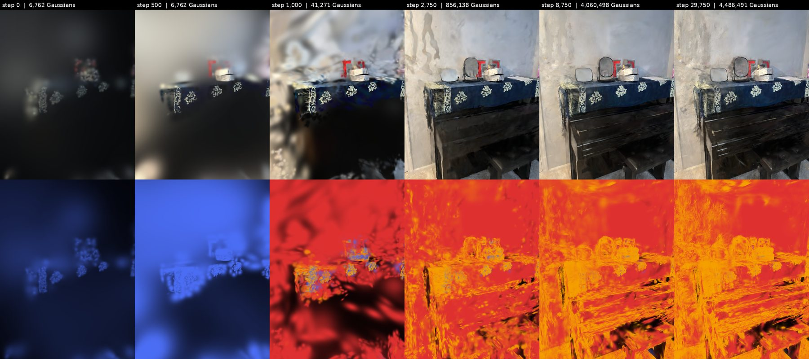
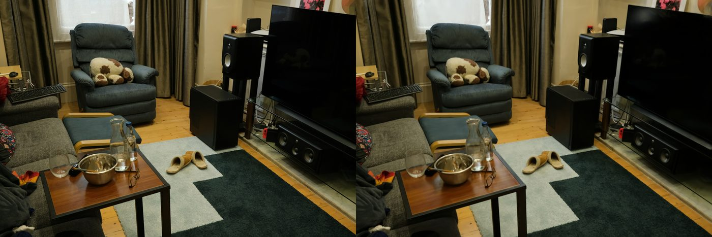
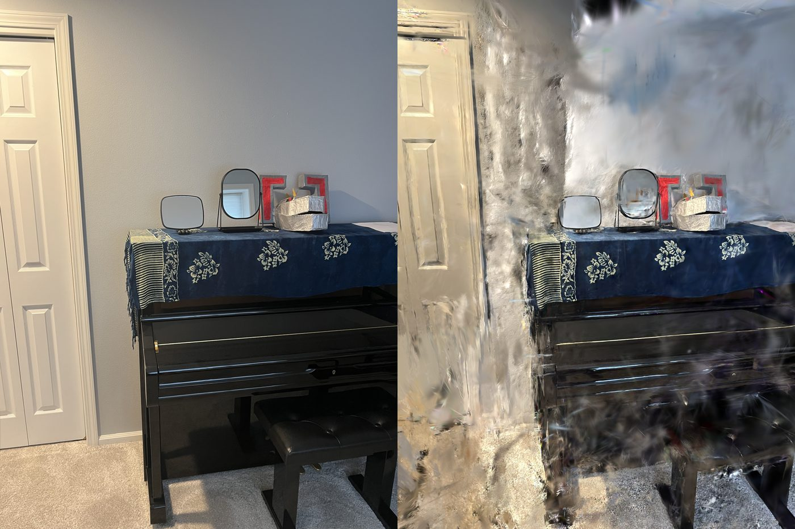
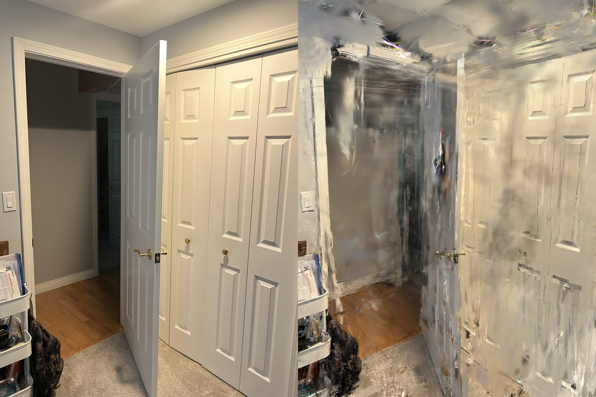
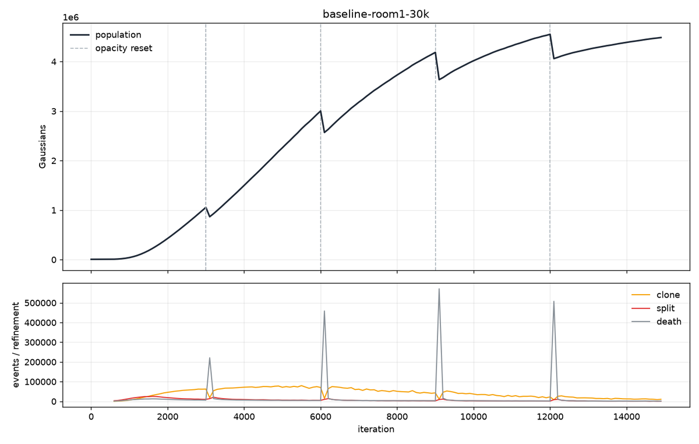
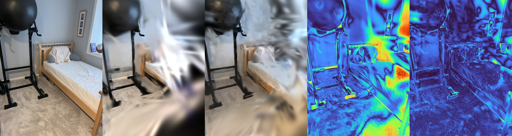
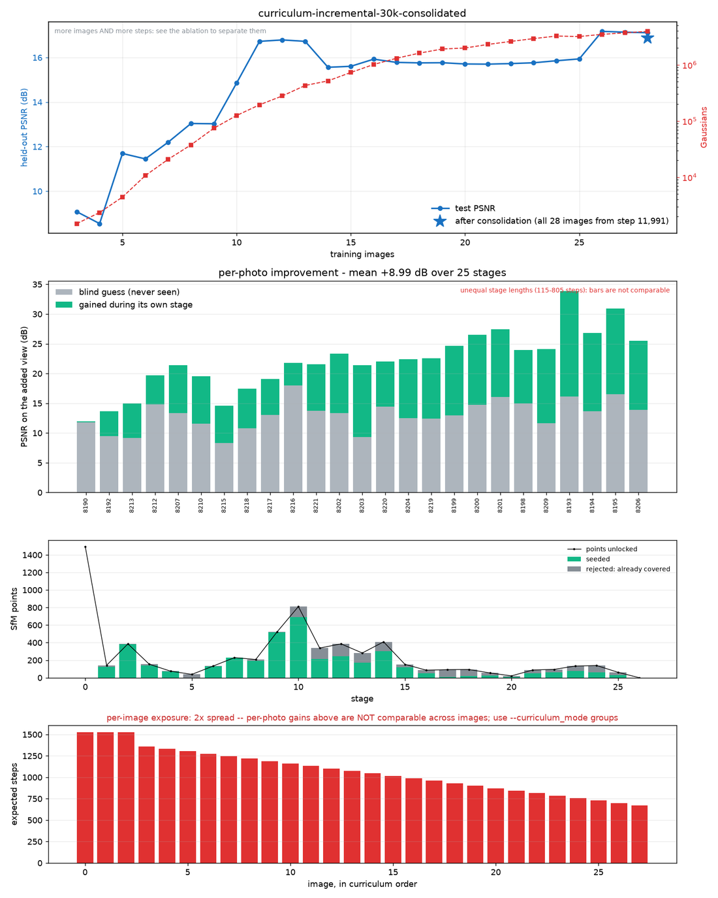
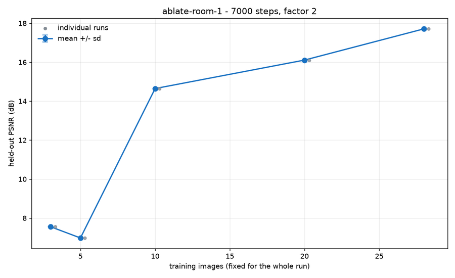

# Room Gaussian Splatting

Reconstructing a real room from **32 phone photos** with 3D Gaussian Splatting, built so every step of
training can be watched: the Gaussians start at the SfM point cloud, then clone, split and prune, and
each new photo improves the model.

The optimizer is [gsplat](https://github.com/nerfstudio-project/gsplat)'s reference trainer and its
`DefaultStrategy` densification, used unchanged. This repo adds a **visibility layer** on top of it:

- **Gaussian lineage:** every Gaussian gets an id, a birth reason (`sfm` / `seed` / `clone` / `split`) and a parent.
- **An event log** of every birth, death and opacity reset.
- **fp16 snapshots** taken during training.
- **An image-by-image curriculum.**
- **A playback viewer.**
- **Report plots.**



*One training camera, rendered from snapshots of the final run. Top: RGB. Bottom: each Gaussian coloured
by where it came from: blue for an SfM point, orange for a clone, red for a split. The run starts at 6,762 SfM points, stays blobby through
the 500-step warm-up, and reaches 4.49M Gaussians once densification has cloned and split almost
everything.*

---

## Status

| Phase | Status | Result |
|---|---|---|
| 0 Toolchain (RTX 5090, sm_120, CUDA 13) | ✅ | torch 2.9.1+cu130, gsplat 1.6.0 built from source, 4 CUDA extensions verified |
| 1 Baseline on Mip-NeRF 360 "room" | ✅ | **31.30 dB / 1.57M Gaussians**, against 31.36 dB / 1.59M published |
| 2 Capture + SfM (`room-1`) | ✅ | 32/32 images registered, 0.93 px reprojection error, 6,762 points |
| 3 Instrumentation | ✅ | lineage, event log, snapshots, reports; byte-identical to `DefaultStrategy` |
| 4 Playback viewer | ✅ | timeline scrubbing, colour by origin or age, lineage tracing, GT/render/error |
| 5 Image curriculum + ablation | ✅ | incremental and groups modes, consolidation stage, image-count ablation |
| 6 Full-quality room run | todo | `--data_factor 1`, and more photos |

There are 272 unit tests. [`PLAN.md`](PLAN.md) is the full design and lab notebook.
[`docs/how_it_works.md`](docs/how_it_works.md) is an annotated reading guide to gsplat's densification
code.

---

## Results

### The build is numerically correct

Vanilla `simple_trainer` on Mip-NeRF 360 "room" (30k steps, `--data_factor 2`, held-out views), compared
with gsplat's published numbers:

| | PSNR | SSIM | LPIPS | Gaussians |
|---|---|---|---|---|
| gsplat-30k (published) | 31.36 | — | — | 1.59M |
| **this build** | **31.30** | 0.920 | 0.163 | **1.57M** |

Both metrics land within about 1% of the published values. The Gaussian count matching too means
densification made the same decisions as the reference, so this is not a lucky PSNR. The run took 5 min 49 s
on the RTX 5090 with 2.4 GB peak VRAM.


*Mip-NeRF 360 "room", held-out view: ground truth (left), render (right).*

### My room (`room-1`)

These are held-out views after 30k steps at `--data_factor 2`. The model never trained on them.




| run | PSNR 7k | PSNR 30k | Gaussians | time |
|---|---|---|---|---|
| **plain (all images from step 0)** | 18.95 | **18.84** | 4.49M | 19.6 min |
| incremental curriculum + consolidation | 16.01 | 16.88 | 4.16M | 19.6 min |
| groups curriculum + consolidation | 15.55 | 16.21 | 2.55M | 15.3 min |

Textured, well-covered surfaces reconstruct well, such as the tablecloth, the piano and the door panels.
Plain walls and regions few cameras saw break down into floaters. **The scene is photo-limited.** The
SfM seed has 6,762 points, against 112,627 for the Mip-NeRF 360 room, and 32 photos is the bottom of the
30–100 target. Shooting more photos is the next lever to pull, before tuning any hyperparameters.

### Watching densification



The event log recorded every clone, split and death in the `room-1` run. The population grows from 6.8k
to 4.5M Gaussians, with a prune spike at exactly 3k, 6k, 9k and 12k (gsplat's opacity resets) and no
growth after `refine_stop_iter` = 15k. The events also balance: births − deaths equals the trainer's own
Gaussian count, to the unit.

### Adding photos one at a time



*Incremental mode, one stage. Left to right: the new photo; the model's **blind guess** from that pose
before it has trained on the photo; the render after the stage; the error before; the error after.*



The curriculum report shows four panels:

1. Held-out PSNR as images are added.
2. The per-photo improvement: the grey bar is the blind guess and the green bar is what the photo's own
   stage added.
3. How many new SfM points each photo unlocked, and how many of them were seeded as new Gaussians
   versus rejected as already covered.
4. Per-image exposure, which says whether the bars in panel 2 can be compared at all.

**Finding:** the curriculum tells the story well, but it trains worse. It trails the plain run by about
2 dB even with a final consolidation stage on all images, so the final model uses the plain run.

### How many photos does it take?



The ablation trained on a fixed set of N images for the same 7k steps each:

| N images | 3 | 5 | 10 | 20 | 28 |
|---|---|---|---|---|---|
| held-out PSNR | 7.56 | 6.98 | 14.65 | 16.11 | 17.71 |

Fewer than 10 photos fail outright on unseen views, and the curve is still climbing at 28 photos. Each
condition is a single run (n = 1). Run-to-run noise is about 0.7 dB, so the 5 → 10 jump is real and the
top of the curve is suggestive.

---

## How it works

```
photos ─► run_sfm.py (pycolmap) ─► COLMAP model ─► gsplat simple_trainer (vendored, pinned)
                                                     │  + splat hooks: lineage · events · snapshots · curriculum
                                                     ├─► live viser viewer (built into simple_trainer)
                                                     └─► run dir ─► playback viewer · report · PLY
```

The trainer in `third_party/gsplat_examples/` is copied from gsplat at the pinned commit `28e794ca`. Our
four small edits are marked `# [splat]`:

1. **Strategy:** swaps in `InstrumentedStrategy`, a `DefaultStrategy` subclass that assigns ids and logs
   events. Given identical inputs, it produces byte-identical params.
2. **Init:** in curriculum mode, starts from only the SfM points the first images can triangulate.
3. **Data:** the sampler draws only from active images, and stages advance with seeding and before/after
   renders.
4. **End of step:** writes a snapshot every N steps.

| module | role |
|---|---|
| `splat/sfm.py` | COLMAP SfM with pycolmap, written in the layout gsplat's Parser expects |
| `splat/lineage.py` | `InstrumentedStrategy`: ids, parents, clone/split/prune events |
| `splat/events.py` | the event log, stored as parquet (~3 bytes/event) |
| `splat/snapshots.py` | light fp16 snapshots (~26 bytes/Gaussian) and a reader |
| `splat/timeline.py` | snapshots and events as one index: lineage, ages, narration |
| `splat/viewer.py` | viser playback viewer, built on gsplat's `simple_viewer` |
| `splat/curriculum.py` | image ordering, stage schedule, seed selection (pure numpy) |
| `splat/append.py` | injects seed Gaussians, keeping params, Adam state and strategy state aligned |
| `splat/stages.py` | stage boundaries: active-image sampler, blind guesses, per-Gaussian deltas |
| `splat/ablation.py` | image-count ablation and the power arithmetic |
| `splat/report.py` | population, training and curriculum plots |

---

## Usage

**Environment** (native Ubuntu 24.04 with an NVIDIA GPU; the setup targets an RTX 5090 / sm_120):

```bash
./scripts/setup_env.sh            # builds torch cu130 + gsplat and its CUDA extensions (~1 h, mostly gsplat)
./scripts/setup_env.sh --check    # verify an existing install
```

**1. Structure from Motion.** Photos go in `photos/<scene>/`. The script writes `data/scenes/<scene>/`.

```bash
.venv/bin/python scripts/run_sfm.py --images photos/room-1
.venv/bin/python scripts/viz_sfm.py --scene data/scenes/room-1 --out sfm.json   # points, poses, covisibility as JSON
```

**2. Train.** This is gsplat's trainer plus the `[splat]` flags:

```bash
# plain run, instrumented
.venv/bin/python third_party/gsplat_examples/simple_trainer.py default \
    --data_dir data/scenes/room-1 --data_factor 2 --result_dir data/runs/room1-30k \
    --lineage --snapshot_every 250 --save_ply

# image-by-image curriculum (use --curriculum_mode groups for equal exposure per image)
.venv/bin/python third_party/gsplat_examples/simple_trainer.py default \
    --data_dir data/scenes/room-1 --data_factor 2 --result_dir data/runs/room1-incremental \
    --lineage --snapshot_every 250 --curriculum --curriculum_mode incremental
```

**3. Watch, report, export.**

```bash
.venv/bin/python scripts/view.py --run room1-30k           # playback viewer on localhost:8080
.venv/bin/python scripts/view.py --run room1-30k --check   # summarize what the run contains

.venv/bin/python -c "from splat.paths import RunPaths, data_root; from splat.report import report; \
                     print(report(RunPaths(data_root()/'runs'/'room1-30k')))"

.venv/bin/python scripts/export_ply.py --run room1-30k     # PLY from checkpoints, for SuperSplat
```

**Ablation:**

```bash
.venv/bin/python scripts/ablate.py --repeats 5 --plan      # what it would cost and what it could resolve
.venv/bin/python scripts/ablate.py --repeats 1 --max-steps 7000 --data-factor 2 --out ablate-room-1
```

**Tests:**

```bash
.venv/bin/python -m pytest tests/
```

`data/` and `photos/` are gitignored. Scenes live in `data/scenes/`, and runs live in `data/runs/`.
Set `DATA_ROOT` to move them elsewhere.
